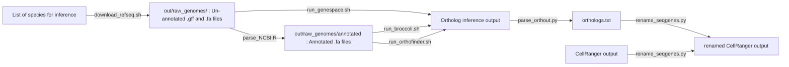

# Updating scRNAseq data with orthologs

0. **Environment setup and software** 

    Python dependencies are listed in `py-requirements.txt` .

    R dependencies can be installed using `install-req.R`.

    Ortholog inference methods are available via GitHub:

			- [GeneSpace](https://github.com/jtlovell/GENESPACE)
			-  [Broccoli](https://github.com/rderelle/Broccoli)
			- [OrthoFinder](https://github.com/davidemms/OrthoFinder)

	

1. **Download genome data from NCBI** 
using `download_refseq.sh`, which takes space-separated species identifiers as an argument and outputs their genomic and peptide information to `out/transcripts/Species/Species/annotation/` (underscores are removed from species identifiers when saving so that IDs play well with GeneSpace).

		$ bash scripts/download_refseq.sh Danio_rerio Homo_sapiens Anopheles_gambiae

    If you are using Broccoli or OrthoFinder for inference, the data will need to be annotated using `parse_NCBI.R`, which merges genomic and proteome data into annotated FASTAs in `out/transcripts/annotated`:
					
		$ Rscript scripts/parse_NCBI.R -d out/transcripts

2. **Infer orthology** 
using [GeneSpace](https://github.com/jtlovell/GENESPACE), [Broccoli](https://github.com/rderelle/Broccoli), or [OrthoFinder](https://github.com/davidemms/OrthoFinder)

	*GeneSpace:* the `run_Genespace.R` script executes the Genespace workflow (annotating genomic data, running OrthoFinder, and then inferring orthologs via synteny). The `-w` flag defines the working directory where outputs will be written.
	
		$ Rscript scripts/run_Genespace.R
			-w out/orthology	    # working directory
			-g out/transcripts 		# transcripts
			-s 'Danio_rerio, Homo_sapiens, Anopheles_gambiae'		# list of species
	
	
	*Broccoli:* Broccoli writes outputs to the working directory that the script is being run from.

		$ cd out/orthology
		$ python ~/Broccoli/broccoli.py 
			-dir ../out/transcripts/annotated # directory where transcripts are

	*OrthoFinder:* 

		$ orthofinder -f out/transcripts/annotated # directory where transcripts are
		-o out/orthology # directory for output

3. **Parse orthology output** 
using ``parse_orthout.py``, which pulls out and formats orthogroup information for two species of interest. The input file will be different depending on which orthology inference method you use.
	
	*Genespace:* 
	``out/orthology/results/gffWithOgs.txt.gz``

	*Broccoli:* 
	``out/orthology/dir_step3/table_OGs_protein_names.txt``

	*OrthoFinder:* 
	``out/orthology/Results_Jun21/Orthogroups/Orthogroups.tsv``

		$ python scripts/parse_orthout.py 
			--orthologs out/orthology/results/gffWithOgs.txt.gz
			--method GeneSpace
			--s1 Daniorerio
			--s2 Homosapiens
			--out out/orthology/Dr_Hs_parsed.txt

4. **Rename scRNAseq data** based on orthology using ``rename_seqgenes.py``, which uses the parsed ortholog data to modify CellRanger output. The script takes the output directory from CellRanger (containing `barcodes.tsv.gz`, `features.tsv.gz`, `matrix.mtx.gz`), renames or removes features according to orthology data, then creates a modified version of the CellRanger output directory for use in integration analysis.

		$ python scripts/rename_seqgenes.py 
			--cellranger filtered_feature_bc_matrix_Homosapiens # cellranger data directory
			--orthologs out/orthology/Dr_Hs_parsed.txt # parsed ortholog tsv from parse_orthout.py
			--sp Homosapiens # ID of source species
			--st Daniorerio # ID of species use for gene names
			--strict 1 # strictness for renaming
			--out out/cellranger_Homosapiens_renamed/
